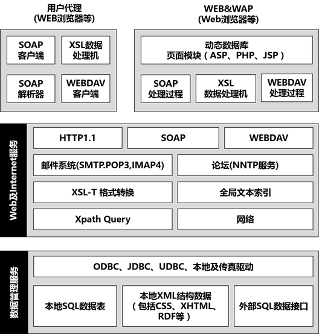
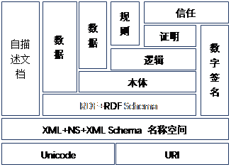
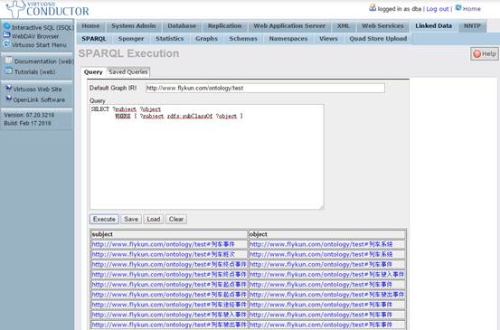
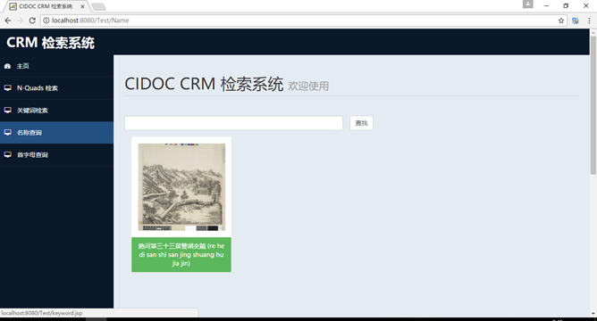
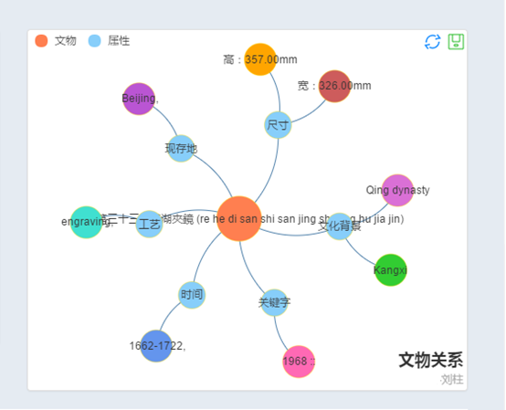

# 介绍和背景

### Virtuoso数据库引擎简介

OpenLink Virtuoso是第一款将本地XML存储和通用数据访问中间件数据库，文件和数据库服务器功能的跨平台通用服务器作为单一服务器解决方案。它包括支持关键的Internet，Web和数据访问标准，它为新一代网络的开发和部署提供了遍历，能够将不同数据库和数据源的数据连接起来。在知识库领域，他支持RDF和SPARQL查询，他优越的性能得到了学术界的认同，大量的评测结果，它都名列前茅，属于开源软件中值得推荐的一款处理RDF的数据库系统。

Virtuoso是高性能虚拟数据库引擎。它是一种核心的通用数据访问技术，可以加快我们在新兴信息时代的进步。

Virtuoso提供对现有数据源的透明访问，这些数据源通常来自不同数据库供应商的数据库。通过连接，Virtuoso能同时将您的ODBC，JDBC，UDBC，OLE-DB客户端应用程序和服务连接到Oracle，Microsoft SQL Server，DB / 2，Informix，Progress，CA-Ingres和其他ODBC兼容数据库引擎中的数据。所有数据库都被视为单个逻辑单元。

下图显示了如何根据行业标准（例如ODBC，JDBC，UDBC和OLE-DB）构建的应用程序只需要通过Virtuoso的虚拟数据库引擎进行单一连接，最终实现并发和实时访问到不同数据库类型的数据。

## 那么说到RDF就要提到语义WEB了

### 语义WEB

语义WEB是让机器可以理解数据。语义WEB技术，它包括一套描述语言和推理逻辑。它包通过一些格式对本体（Ontology）进行描述。“本体”这个术语来自于哲学，它是研究世界上的各种实体以及他们是怎么关联的科学。对于 web，本体则关于对 web 信息及 web 信息之间的关系的精确描述。

Web语义体系结构如图1-2所示

**图****1**-**2**

语义WEB体系结构的大致分为7层，每一层都是在前一层的基础之上建立的。

最底层也就是第一层是Unicode和URL。Unicode是一种字符集，计算机发明后，为了在计算机中表示字符，人们制定了一种编码，叫ASCII码。ASCII码由一个字节中的7位(bit)表示，范围是0x00 - 0x7F 共128个字符。后来他们突然发现，如果需要按照表格方式打印这些字符的时候，缺少了“制表符”。于是又扩展了ASCII的定义，使用一个字节的全部8位(bit)来表示字符了，这就叫扩展ASCII码。范围是0x00 - 0xFF 共256个字符。中国人利用连续2个扩展ASCII码的扩展区域（0xA0以后）来表示一个汉字，该方法的标准叫GB-2312。后来，日文、韩文、阿拉伯文、台湾繁体（BIG-5）等等都使用类似的方法扩展了本地字符集的定义，现在统一称为 MBCS 字符集（多字节字符集）。这个方法是有缺陷的，因为各个国家地区定义的字符集有交集，因此使用GB-2312的软件，就不能在BIG-5的环境下运行（显示乱码），反之亦然。为了把全世界人民所有的所有的文字符号都统一进行编码，于是制定了UNICODE标准字符集。UNICODE 使用2个字节表示一个字符(unsigned shor int、WCHAR、_wchar_t、OLECHAR)。URI，是Uniform Resource Identifier，统一资源标识符，是用来唯一的标识一个资源的字符串。第一层是整个语义体系的基础，后面所有的功能都是建立在此基础上的，UNICODE负责编码，URL负责唯一标识一个资源。

XML指可扩展标记语言（Extensible Markup Language）, 可以用来标记数据、定义数据类型，是一种允许用户对自己的标记语言进行定义的源语言。 XML使用DTD(Document Type Definition)文档类型定义来组织数据;格式统一，跨平台语言，早已成为业界公认的标准。XML是标准通用标记语言 (SGML) 的子集，非常适合 Web 传输。XML 提供统一的方法来描述和交换独立于应用程序或供应商的结构化数据。NS(NameSpace)就是命名空间，主要由URI确定，用来防止不同的编程者，使用同一个描述表示不同的事物。XML Schema是基于XML语法的，比之前提到的DTD更灵活，替代了DTD。可以将WEB上的数据表现、格式、内容分离开来，更加清晰，可扩展性也更强。

RDF（Resource Description Framework），资源描述框架是在Web中表示信息的框架。RDF概念定义了一种抽象语法（数据模型），用于链接所有基于RDF的语言和规范。抽象语法有两个关键数据结构：RDF图是主题 - 谓词 - 对象三元组的集合，其中元素可以是IRI，空白节点或数据类型的文字。它们用于表示资源的描述。RDF数据集用于组织RDF图的集合，并包含一个默认图形和零个或多个命名图形。RDF Schema (RDFS) 是对 RDF 的一种扩展，用来定义应用程序专用的类和属性。这种扩展用于RDF 通过类、属性和值来描述资源。RDF Schema 不提供实际的应用程序专用的类和属性，而是提供了描述应用程序专用的类和属性的框架。在XML的基础之上，使用了XML的语法结构，并提供了语义定义。

本体描述由一组类型，属性和关系类型组成的世界的模型。Ontology 是在RDFS的基础上定义的，主要不同点在于Ontology 不仅定义了属性更定义了关系。

N-Triples是用于存储和发送数据的格式。它是用于RDF（资源描述框架）图形的基于行的纯文本序列化格式，以及Turtle（Terse RDF Triple Language）格式的一个子集。N-Quads是用于对RDF数据集进行编码的基于行的纯文本格式。N-Quads格式与N-Triples [ n-triples ] 类似。主要区别在于N-Quads允许编码多个图。

## RDF的查询语言SparQL

### SparQL

SPARQL是一种用于与RDF图形匹配的查询语言。语法类似于SQL，为了友好的学习曲线，但SPARQL功能更强大，可以跨多个不同（本地或远程）包含异构半结构化数据的数据源进行查询。

无论数据是作为RDF存储还是通过中间件视为RDF，都可以使用SPARQL来表示不同数据源之间的查询。SPARQL包含查询所需和可选图形模式及其连接和分离功能。SPARQL还支持聚合，子查询，否定，通过表达式创建值，可扩展值测试以及按源RDF图约束查询。SPARQL查询的结果可以是结果集或RDF图。

# 源代码分析

### 原始数据分析

[https://github.com/liuzhu334/virtuoso-opensource/blob/develop/7/binsrc/virtuoso/viconfig.c](https://github.com/liuzhu334/virtuoso-opensource/blob/develop/7/binsrc/virtuoso/viconfig.c)

static int //静态函数

db_lck_lock_fd (int fd, char *name)

{

#if defined (F_SETLK)

 struct flock fl = {0};

 /*获得一个写操作的锁*/

 fl.l_type = F_WRLCK;

 fl.l_whence = SEEK_SET;

 fl.l_start = 0;

 fl.l_len = 0;

 fl.l_pid = getpid ();

 if (fcntl (fd, F_SETLK, &fl) < 0)

 {

 log (L_ERR, "Unable to lock file %s (%m).", name);

 /* 我们得不到锁，返回锁的归属 */

 fcntl (fd, F_GETLK, &fl);

 log (L_ERR, "Virtuoso is already runnning (pid %ld)", fl.l_pid);// 写日志

 return -1;

 }

#elif defined (HAVE_FLOCK_IN_SYS_FILE)

 if (flock (fd, LOCK_EX | LOCK_NB)) //不能加锁

 {

 log (L_ERR, "Unable to lock file %s (%m).", name);

 return -1;

 }

#endif

 return 0;

}

static void

db_lck_unlock_fd (int fd, char *name)

{

#if defined (F_SETLK)

 struct flock fl = {0};

 /* 解锁 */

 fl.l_type = F_UNLCK;

 fl.l_whence = SEEK_SET;

 fl.l_start = 0;

 fl.l_len = 0;

 fl.l_pid = getpid ();

 if (fcntl (fd, F_SETLK, &fl) < 0)

 log (L_WARNING, "Unable to unlock %s (%m)", name);

#elif defined (HAVE_FLOCK_IN_SYS_FILE)

 if (flock (fd, LOCK_UN | LOCK_NB))

 log (L_WARNING, "Unable to unlock %s (%m)", name);

#endif

}

static void

db_lck_write_pid (int fd)//写进程锁

{

 char pid_arr[50];

 int len;

 snprintf (pid_arr, sizeof (pid_arr), "VIRT_PID=%lu\n", (unsigned long) getpid ());

 len = (int) strlen (pid_arr);

 len = len > sizeof (pid_arr) ? sizeof (pid_arr) : len;

 if (len != write (fd, pid_arr, len))

 {

 log (L_ERR, "Unable to store the PID of the virtuoso process into the lock file : %m");

 }

}

int

db_check_in_use (void)

{

 /* 检查是否在使用 */

 if ((lck_fd = open (c_lock_file, LCK_O_FLAGS, 0644)) == -1)

 {

 log (L_ERR, "Unable to create file %s (%m).", c_lock_file);

 goto failed;

 }

 if (db_lck_lock_fd (lck_fd, c_lock_file))

 goto failed;

 db_lck_write_pid (lck_fd);

#if defined (LCK_CAN_CLOSE)

 close (lck_fd);

 lck_fd = -1;

#endif

 return 0;

failed:

 log (L_ERR, "This probably means you either do not have permission to start");

 log (L_ERR, "this server, or that %s is already running.", MYNAME);

 log (L_ERR, "If you are absolutely sure that this is not the case, please try");

 log (L_ERR, "to remove the file %s and start again.", c_lock_file);

 if (lck_fd >= 0)

 close (lck_fd);

 lck_fd = -1;

 return -1;

}

void

db_not_in_use (void)

{

 if (lck_fd != -1)

 {

 db_lck_unlock_fd (lck_fd, c_lock_file);

 close (lck_fd);

 lck_fd = -1;

 }

#if ! defined (WIN32)

 if (unlink (c_lock_file) == -1)

 log (L_WARNING, "Unable to remove %s (%m)", c_lock_file);

#endif

 dk_memory_finalize();

}

# 实验应用

### 原始数据分析

实验原始数据的一条记录nq格式

//主题：id为JCF9761的项目产品

<http://collection.britishmuseum.org/id/object/JCF9761/production>

//谓词  组成

<http://erlangen-crm.org/current/P9_consists_of>

//对象  组成成分

<http://collection.britishmuseum.org/id/object/JCF9761/production/4>

//所属JCF9761图

<http://collection.britishmuseum.org/id/object/JCF9761/graph> .

### 实验步骤

**安装**

一、下载：

virtuoso下载地址: <u>[http://sourceforge.net/projects/virtuoso/files/](http://sourceforge.net/projects/virtuoso/files/)</u>

1.   6.1.4 to 7.1.0需要安装2010vc++库

（32位）  [http://www.microsoft.com/en-us/download/details.aspx?id=5555](http://www.microsoft.com/en-us/download/details.aspx?id=5555)

（64位）[http://www.microsoft.com/en-us/download/details.aspx?id=14632](http://www.microsoft.com/en-us/download/details.aspx?id=14632)

1.  7.2版本(只有64位的，32位的可以安装7.1)之后需要安装 64位的2012vc++库:<u>[http://www.microsoft.com/en-us/download/details.aspx?id=30679#](http://www.microsoft.com/en-us/download/details.aspx?id=30679)</u>

二、环境变量配置

1.决定virtuoso的安装根目录，一般的，将下载后的压缩包解压，放在C盘目录下，地址可按照 **C:/Program Files/OpenLink Software/VOS7/**

2.添加环境变量（计算机=》属性=》高级设置=》环境变量(系统环境变量)）新建变量 **VIRTUOSO_HOME **值为：**C:/Program Files/OpenLink Software/VOS7/virtuoso-opensource/  ** (注意目录名称根据自己的命名变化)

 3.在系统环境变量**PATH**中将该变量添加进去(命令行能调用)  

        ;%VIRTUOSO_HOME%/bin;%VIRTUOSO_HOME%/lib

 4.点击“确定”或“退出“直到退出”控制面板“。  

 三、基础安装

1.将一步骤中下载的.zip文件解压缩到二、1中选择的文件夹中，这会创建一个virtuoso-opensource的目录，它包含了6个子文件夹:

bin

lib

hosting

database

vad

vsp

由于现在的windows包缺失一个php.ini文件，在virtuoso-opensource目录下的 database子目录下新建 php.ini配置文件  内容为：

 <u>[http://ftp://download.openlinksw.com/support/vos/php.ini](http://ftp/download.openlinksw.com/support/vos/php.ini)</u>

2．验证Virtuoso的安装

在控制台输入命令 virtuoso-t -? 如果成功为显示该命令的帮助。

注：同时也提供有Java (virtuoso-javavm-t) 和 .NET CLR (virtuoso-clr-t) 管理支持，如果需要此类型支持的话，可以完全代替 virtuoso-t。

3.运行命令 cd %VIRTUOSO_HOME%/database

4.使用下述命令来创建windows服务 

virtuoso-t +service create +instance "Linked data service" +configfile virtuoso.ini

8.如果你不喜欢这个服务名称，可以参照以下命令方式更改：

| **[Action](http://virtuoso.openlinksw.com/dataspace/dav/wiki/Main/VOSUsageWindows?sort=0&col=1)** | **[Command ](http://virtuoso.openlinksw.com/dataspace/dav/wiki/Main/VOSUsageWindows?sort=1&col=2&acs=1)** |
| --- | --- |
| **List all Virtuoso services** | virtuoso-t +service list |
| **Start a Virtuoso service** | virtuoso-t +instance "Instance Name" +service start |
| **Stop a Virtuoso service** | virtuoso-t +instance "Instance Name" +service stop |
| **Delete a Virtuoso service** | virtuoso-t +instance "Instance Name" +service delet |

四、Virtuoso Conductor——基于HTTP浏览器的 Virtuoso管理工具

Virtuoso Conductor是一个基于HTTP的管理工具，  默认包含了Virtuoso所有的实例可以使用下述URL获取：

http://<virtuoso-host-FQDN-or-IP-address>:<HTTP-port>/conductor

比如：[http://localhost:8890/conductor](http://localhost:8890/conductor)

或是：[http://my-virtuoso-host.example.com:8890/conductor](http://my-virtuoso-host.example.com:8890/conductor)

然后Conductor就可以被用于安装其他的Virtuoso VAD 应用，通过搜索 "System Admin -> Packages" 标签来获取，选择需要的包然后安装，然后他们就可以作为你的 Virtuoso服务器的实例了。

**JDBC****调用**

//创建virtuoso连接

VirtGraph set = new VirtGraph("jdbc:virtuoso://localhost:1111", "dba","dba");

//使用SparQL语句与sql类似

String sql = "SELECT * from <"+graph+"> WHERE { ?s <http://www.w3.org/2000/01/rdf-schema#label> ?o } limit 2000";

//之后与常用数据库基本无异

Query sparql = QueryFactory.create(sql);

最后完成图

