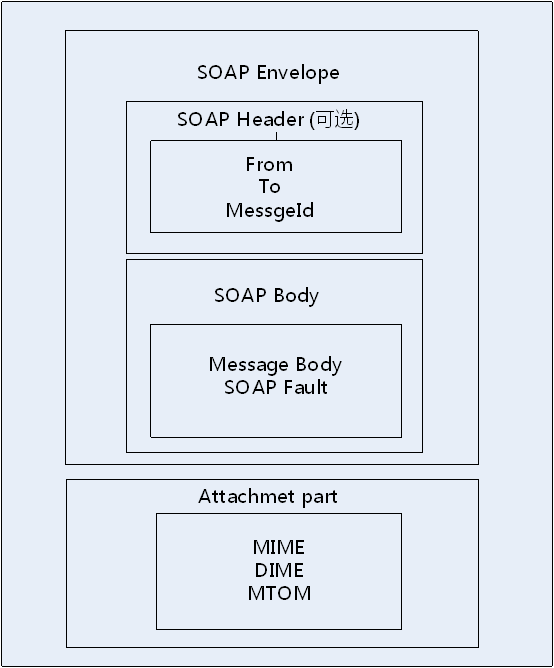
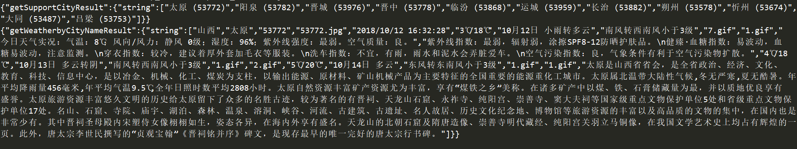
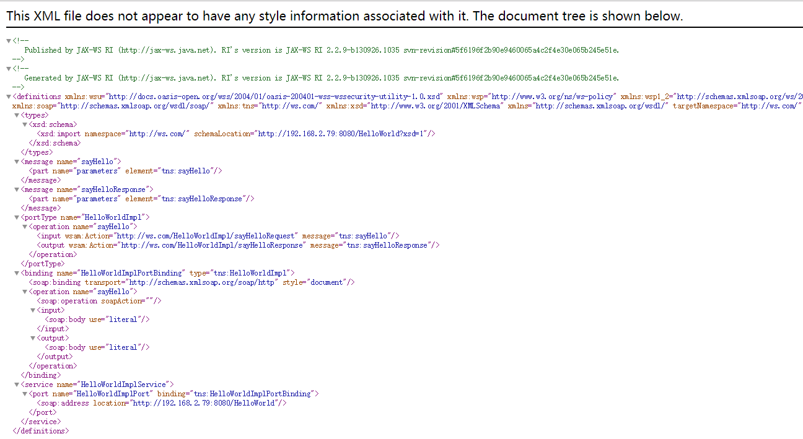
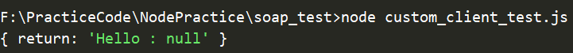

## 1. 中间件概述

+ ### 中间件的历史

  	90年代，文顿·瑟夫这位互联网之父的发明成为改变IT业的重大革命性创新。互联网促使分布式系统和网络应用的诞生，中间件就是伴随网络技术的产生、发展而兴起的，可以说没有网络就没有现代意义上的中间件。因为，网络环境需要解决异构分布网络环境下软件系统的通信、互操作、协同、事务、安全等共性问题，提高异构分布网络环境下软件系统的互操作性、可移植性、适应性、可靠性等问题。

  + 1990年诞生与贝尔实验室的Tuxedo系统作为中间件的诞生标志。Tuxedo解决了分布式交易事务控制问题，中间件开始成为网络应用的基础设施，中间件正式成型，这是最早的交易中间件。
  + 1994年IBM发布消息队列服务MQ系列产品，解决分布式系统异步、可靠、传输的通讯服务问题，消息中间件诞生。
  + 1995年，JAVA之父James Gosling发明JAVA语言，JAVA提供了跨平台的通用的网络应用服务，成为今天中间件的核心技术。JAVA是第一个天生的网络应用平台，特别是J2EE发布以来，JAVA从一个编程语言，演变为网络应用架构，成为应用服务平台的事实标准。应用服务器中间件，成为中间件技术的集大成者，也成为事实上的中间件的核心。

+ ### 中间件发展的驱动力

  + 屏蔽异构性：屏蔽由于自市场竞争、技术升级以及保护投资等因素产生的异构平台的差异性。
  + 实现互操作：减轻由于标准滞后造成的平台移植性差，网络协议和通信机制不同造成的集成难题。
  + 共性凝练和复用：长期探索中，解决这些问题的办法主要是两个方面：工程方法、平台与技术。工程方法主要指软件工程相关；而技术手段包括：更好的程序设计语言、更好的平台和软件开发技术，如面向对象、组件开发、面向服务等等。而这方面，在技术上逐渐发展的成果大部分都凝聚在今天的中间件平台之中。

+ ### 中间件的概念

  	我国学术界一般认可的定义是中间件是指网络环境下处于操作系统、数据库等系统软件和应用软件之间的一种起连接作用的分布式软件，主要解决异构网络环境下分布式应用软件的互连与互操作问题，提供标准接口、协议，屏蔽实现细节，提高应用系统易移植性（北京大学梅宏）。分类如下：

  + 消息中间件
  + 交易中间件
  + 对象中间件
  + 应用服务器
  + 安全中间件
  + 应用集成服务器


## 2.开源项目分析 （node-soap）

+ ### 项目源码

  https://github.com/vpulim/node-soap

+ ## node-soap背景分析

  + **SOA**：即Service Oriented Architecture ，中文一般理解为面向服务的架构。从及软件的基本原理定义，可以认为SOA是一个组件模型，它将应用程序的不同功能单元（服务）通过这些服务之间定义良好的接口和契约联系起来。SOA对于实现企业资源共享，步骤是：把应用和资源转换成服务；把这些服务变成标准的服务，形成资源的共享。
  + **Web Service**：提供一个建立分布式应用的平台，使得运行在不同操作系统和不同设备上的软件，或者是用不同的程序语言和不同厂商的软件开发工具开发的软件，所有可能的已开发和部署的软件，能够利用这一平台实现分布式计算的目的。Web Service的思想是：使得应用程序也具有 Web 分布式编程模型的松散耦合性。最基本的Web Service是基于XML和HTTP的。在Web服务的体系结构中，涉及到三个角色：Web服务提供者；Web服务请求者；Web服务中介者。值得一提的是，Web服务请求者通过服务注册中心（Web服务中介者）查找所需的服务，再利用SOAP消息向Web服务提供者发送请求以获得服务。还涉及到三类操作：发布、查找、绑定。（逻辑类似于观察者模式）
  + **SOAP**（Simple Object Access Protocol）：简单对象访问协议。用于访问Web服务的协议。SOAP基于XML和HTTP，通过XML来实现消息描述，然后通过HTTP实现消息传输。SOAP和其他的Web服务协议构建起SOA应用的技术基础。
  + **WSDL**（Web Service Description Language）：Web服务描述语言。是基于XML用于描述Web服务以及如何访问Web服务的语言。服务提供者通过服务描述将所有用于访问 Web服务的规范传送给服务请求者，不管是请求者还是服务提供者，通过服务描述便可以不必了解对方的底层平台，编程语言等，服务描述与底层的 SOAP 基础结构相结合，足以封装服务请求者的应用程序和服务提供者的 Web服务之间的这个细节。
  + **UDDI**（ Universal Description，Discovery and Integration）：通用的描述发现以及整合。简单来时候话，UDDI 就是一个目录，只不过在这个目录中存放的是一些关于 Web 服务的信息而已。Web 服务提供商使用UDDI将自己开发的 Web 服务公布到因特网上。
  + **SOAP与REST比较**：Web Service有两种方式，一种是SOAP协议方式；另一种是REST方式，这种方式不需要WSDL，UDDI等。目前来看REST方式现在看来更加流行。

+ ## node-soap原理

  + SOAP结构，如下图所示：

    

    + 必需的 Envelope 元素，可把此 XML 文档标识为一条 SOAP 消息，XML文件的顶层元素，代表该文件为SOAP消息
    + 可选的 Header 元素，包含头部信息
    + 必需的 Body 元素，包含所有的调用和响应信息
    + 可选的 Fault 元素，提供有关在处理此消息所发生错误的信息
    + 可选的Attachment，主要用于传递附件，扩展的SOAP消息

  + SOAP命名空间

    ```javascript
    SOAP_NMAC struct Namespace namespaces[] =
    {
        {"SOAP-ENV", "http://schemas.xmlsoap.org/soap/envelope/", "http://www.w3.org/*/soap-envelope", NULL},
        {"SOAP-ENC", "http://schemas.xmlsoap.org/soap/encoding/", "http://www.w3.org/*/soap-encoding", NULL},
        {"xsi", "http://www.w3.org/2001/XMLSchema-instance", "http://www.w3.org/*/XMLSchema-instance", NULL},
        {"xsd", "http://www.w3.org/2001/XMLSchema", "http://www.w3.org/*/XMLSchema", NULL},
        {"ns", "urn:calc", NULL, NULL},
        {NULL, NULL, NULL, NULL}
    };
    ```

    	这里的URL并不是指向文件，而只是一个名字。如果一个SOAP应用程序接收了一个消息，而该消息的SOAP Envelope元素使用和上述不同的名称空间，则该应用程序就将其视为版本错误并忽略该消息。

+ ## node-soap源码分析

  + ### 源码目录结构，如下所示

    ```
    .
    │  client.js								//webservice client⭐
    │  http.js									//⭐
    │  nscontext.js								//wsdl namespace
    │  server.js
    │  soap.d.ts
    │  soap.js									//api interface⭐
    │  utils.js
    │  wsdl.js									//wsdl xml2obj, obj2xml
    │
    └─security
        │  BasicAuthSecurity.js
        │  BearerSecurity.js
        │  ClientSSLSecurity.js
        │  ClientSSLSecurityPFX.js
        │  index.js
        │  NTLMSecurity.js
        │  WSSecurity.js
        │  WSSecurityCert.js
        │
        └─templates
                wsse-security-header.ejs
                wsse-security-token.ejs
    ```

    	在上面的文件树中，用⭐标注出来的几个文件是我们重点关注的。

  + ### createClient()的具体实现

    ```javascript
    "use strict";
    
    var Client = require('./client').Client,
      Server = require('./server').Server,
      HttpClient = require('./http'),
      security = require('./security'),
      passwordDigest = require('./utils').passwordDigest,
      open_wsdl = require('./wsdl').open_wsdl,
      WSDL = require('./wsdl').WSDL;
    
    var _wsdlCache = {};
    
    function _requestWSDL(url, options, callback) {
      ... 
      // 通过wsdl URL从request或者本地cache中获取wsdl对象，然后调用callback，传回
      else {
        open_wsdl(url, options, function(err, wsdl) {
          if (err) {
            return callback(err);
          } else {
            _wsdlCache[url] = wsdl;
          }
          callback(null, wsdl);
        });
      }
    }
    
    function createClient(url, options, callback, endpoint) {
      if (typeof options === 'function') {
        endpoint = callback;
        callback = options;
        options = {};
      }
      endpoint = options.endpoint || endpoint;
        // 获取到WSDL对象，然后把wsdl和Client对象&&处理，通过callback传回，也就是createClient
        回调中的client参数
      _requestWSDL(url, options, function(err, wsdl) {
        callback(err, wsdl && new Client(wsdl, endpoint, options));
      });
    }
    
    function listen(server, pathOrOptions, services, xml) {
         // server 相关，先不关心
        ...
    }
    ```

    + _requestWSDL: 基于url获取wsdl内容，并构建wsdl对象。缓存wsdl对象
    + new Client(wsdl, endpoint, options)，通过wsdl，服务endpoint，配置options构建client对象

  + ### Client的构建

    ```javascript
    var Client = function(wsdl, endpoint, options) {
      events.EventEmitter.call(this);
    
      options = options || {};
      this.wsdl = wsdl;
      this._initializeOptions(options);
        // 重点看这个
      this._initializeServices(endpoint); 
      this.httpClient = options.httpClient || new HttpClient(options);
    };
    ```

    + 初始化配置,初始化服务（API）
    + 服务对象格式化XML文档
    + 发送XML文档，处理响应body

  + ### 初始化Services 

    ```javascript
    Client.prototype._initializeServices = function(endpoint) {
      var definitions = this.wsdl.definitions,
        services = definitions.services;
      for (var name in services) {
        this[name] = this._defineService(services[name], endpoint);
      }
    };
    
    // Port关联到service树结构中
    Client.prototype._defineService = function(service, endpoint) {
      var ports = service.ports,
        def = {};
      for (var name in ports) {
        def[name] = this._definePort(ports[name], endpoint ? endpoint : ports[name].location);
      }
      return def;
    };
    
    // method关联到service树结构中
    Client.prototype._definePort = function(port, endpoint) {
      var location = endpoint,
        binding = port.binding,
        methods = binding.methods,
        def = {};
      for (var name in methods) {
        def[name] = this._defineMethod(methods[name], location);
        this[name] = def[name];
      }
      return def;
    };
    
    // 最终function(args, callback, options, extraHeaders)作为叶子关联到services的树中，
    // 安放到对应的port和method下. 
    // client.runMethod(args, function(){})实际会调用这个叶子function
    // 而这个函数，根本上，调用了_invoke
    Client.prototype._defineMethod = function(method, location) {
      var self = this;
      var temp;
      return function(args, callback, options, extraHeaders) {
        ...
        self._invoke(method, args, location, function(error, result, raw, soapHeader)          {
          callback(error, result, raw, soapHeader);
        }, options, extraHeaders);
      };
    };
    ```

    1. 从wsdl解析definitions
    2. definitions中解析services
    3. services中解析ports
    4. ports中解析methods
    5. 为每一个methods定义一个函数，这个函数实际上就是_invoke函数。
    6. 最后，用户通过client.xxxxMethod(args, callback, options, extraHeaders）会调用这个invoke

+ ## node-soap实践

  + ### 简单尝试client，获取天气数据

    ```javascript
    const soap = require('soap');
    
    const url = 'http://www.webxml.com.cn/WebServices/WeatherWebService.asmx?wsdl';
    
    let soaptest = ()=>{
        soap.createClient(url,(err,client)=>{
            client.getSupportCity({byProvinceName: '山西'},(err,result)=>{
               console.log(result)
            })
            client.getWeatherbyCityName({theCityName:'太原'},(err,result)=>{
                console.log(result)
            })
        })
    };
    
    soaptest();
    ```

    	执行结果如下图所示：

    

  + ### 创建server

    + #### 创建Webservice

      ```java
      package com.service.impl;
      
      import javax.jws.WebService;
      
      //@WebService用于标识该类为WebService类
      @WebService
      public class HelloWorldImpl {
          public String sayHello(String text) {
              return "Hello : " + text;
          }
      }
      
      /************************************************************************/
      package com.service;
      
      import javax.xml.ws.Endpoint;
      import com.service.impl.HelloWorldImpl;
      
      public class App {
          public static void main(String[] args) {
              String address = "http://192.168.2.79:8080/HelloWorld";
              Endpoint.publish(address, new HelloWorldImpl());
              System.out.println("发布消息成功");
          }
      }
      ```

      	启动后使用浏览器访问如下图所示：

      

    + #### 使用Client访问Webservice

      ```javascript
      const soap = require('soap');
      
      const url = 'http://192.168.2.79:8080/HelloWorld?wsdl';
      
      let soaptest = ()=>{
          soap.createClient(url,(err,client)=>{
              client.sayHello({parameters:'Hello from node-soap'},(err,result)=>{
                  console.log(result);
              })
          })
      };
      
      soaptest();
      ```

      	运行后可以得到如下结果：

      

    + #### 尝试使用node-soap的server

      ```javascript
      const express = require('express')
      const bodyParser = require('body-parser')
      
      var myService = {
          MyService: {
              MyPort: {
                  MyFunction: function(args) {
                      return {
                          name: args.name
                      };
                  },
      
                  // This is how to define an asynchronous function.
                  MyAsyncFunction: function(args, callback) {
                      // do some work
                      callback({
                          name: args.name
                      });
                  },
      
                  // This is how to receive incoming headers
                  HeadersAwareFunction: function(args, cb, headers) {
                      return {
                          name: headers.Token
                      };
                  },
      
                  // You can also inspect the original `req`
                  reallyDetailedFunction: function(args, cb, headers, req) {
                      console.log('SOAP `reallyDetailedFunction` request from ' + req.connection.remoteAddress);
                      return {
                          name: headers.Token
                      };
                  }
              }
          }
      };
      
      var xml = require('fs').readFileSync('./HelloWorld.wsdl', 'utf8');
      var soap = require('soap');
      
      //express server example
      var app = express();
      //body parser middleware are supported (optional)
      app.use(bodyParser.raw({type: function(){return true;}, limit: '5mb'}));
      app.listen(8001, function(){
          //Note: /wsdl route will be handled by soap module
          //and all other routes & middleware will continue to work
          soap.listen(app, '/wsdl', myService, xml);
      });
      
      ```
